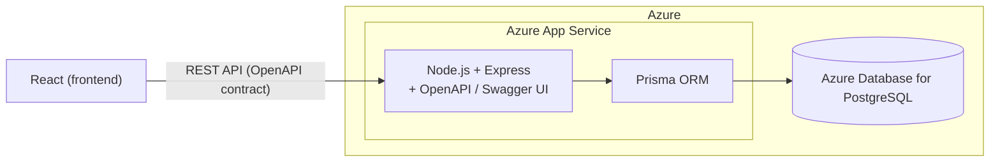

<!-- cSpell:ignore Elokuvaprojekti TMDB OAMK Iisa Veera Topi Tommi -->

# Elokuvaprojekti

A responsive movie web app for browsing and searching movies/series, viewing what's currently in Finnish cinemas, joining groups, writing reviews, and sharing favorite lists. Built with React, Node.js, and PostgreSQL, using [The Movie Database (TMDB)](https://www.themoviedb.org/) as the external movie data source.

School project for the Web Programming course at OAMK (Fall 2026).

Team: Iisa, Veera, Topi, Tommi.

## Architecture (high-level)



## Documentation

- [Scrum backlog plan](scrum-backlog-plan.md)
- [Architecture plan](architecture-plan.md)
- [Implementation plan](implementation-plan.md)
- [Class diagram](docs/class-diagram.md)

> The project documentation is kept in the docs folder and is versioned in Git for easy review on GitHub.

## Backend dependency notes

CI (`.github/workflows/ci.yml`) runs on Ubuntu with `npm ci`, which requires `backend/package-lock.json` to exactly match `backend/package.json` for the target platform. Some optional native dependencies resolve differently on Windows vs. Linux, so a lockfile regenerated with plain `npm install` on Windows can pass locally but still fail `npm ci` in CI.

Whenever you add, update, or remove a backend dependency (any change that touches `backend/package-lock.json`), regenerate the lockfile on Linux before pushing:

```bash
cd backend
docker run --rm -v ${PWD}:/app -w /app node:24 npm install
```

Requires Docker Desktop. Day-to-day work with no dependency changes is unaffected — just use `npm install` as normal.

## Backend test database

Jest sets `NODE_ENV=test`. Database-backed tests must use `TEST_DATABASE_URL`; they never fall back to the development `DATABASE_URL`.

Create `backend/.env.test` from [backend/.env.test.example](backend/.env.test.example) and point it to a separate PostgreSQL database before adding database-backed tests. The current smoke test does not need a database.

## Movie dataset import

`backend/seed.js` populates the local `Movie` and `Genre` tables from TMDB so the app has data to browse without every teammate needing their own TMDB-heavy fetch. Requires `TMDB_READ_ACCESS_TOKEN` (and a reachable `DATABASE_URL`) in `backend/.env`.

```bash
cd backend
npm run seed            # fast path: loads the committed snapshot and upserts it into the DB
npm run seed -- --refresh   # re-fetches from TMDB (popular + now-playing FI + top-rated) and overwrites the snapshot
```

- Default run reuses the committed snapshot at `backend/prisma/seed-data/movies.json` (~1,000-2,000 curated movies, currently 876 movies + 19 genres, ~580 KB) — takes a few seconds, no TMDB calls.
- `--refresh` re-fetches from TMDB across roughly 75+ paginated requests, so it takes a couple of minutes and is subject to TMDB's rate limits (the script fetches pages sequentially, not in parallel, to stay within them).
- Safe to re-run: movies and genres are upserted by `tmdbId` / `tmdbGenreId`, so re-running never creates duplicates.
- Only run `--refresh` when intentionally updating the shared snapshot (commit the regenerated `movies.json` afterward so the whole team stays in sync).
