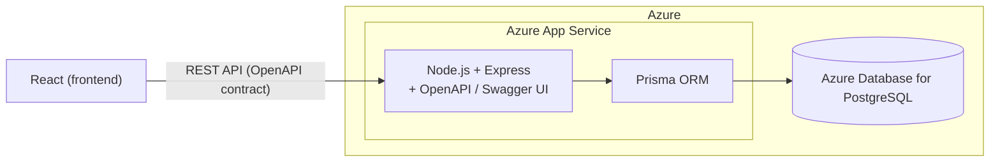

<!-- cSpell:ignore Elokuvaprojekti TMDB OAMK Iisa Veera Topi Tommi -->

# Elokuvaprojekti

A responsive movie web app for browsing and searching movies/series, viewing what's currently in Finnish cinemas, joining groups, writing reviews, and sharing favorite lists. Built with React, Node.js, and PostgreSQL, using [The Movie Database (TMDB)](https://www.themoviedb.org/) as the external movie data source.

School project for the Web Programming course at OAMK (Fall 2026).

Team: Iisa, Veera, Topi, Tommi.

## Architecture (high-level)



## Documentation

- [Scrum backlog plan](scrum-backlog-plan.md)
- [Architecture plan](architecture-plan.md)
- [Implementation plan](implementation-plan.md)
- [Class diagram](docs/class-diagram.md)

> The project documentation is kept in the docs folder and is versioned in Git for easy review on GitHub.

## Backend dependency notes

CI (`.github/workflows/ci.yml`) runs on Ubuntu with `npm ci`, which requires `backend/package-lock.json` to exactly match `backend/package.json` for the target platform. Some optional native dependencies resolve differently on Windows vs. Linux, so a lockfile regenerated with plain `npm install` on Windows can pass locally but still fail `npm ci` in CI.

Whenever you add, update, or remove a backend dependency (any change that touches `backend/package-lock.json`), regenerate the lockfile on Linux before pushing:

```
cd backend
docker run --rm -v ${PWD}:/app -w /app node:24 npm install
```

Requires Docker Desktop. Day-to-day work with no dependency changes is unaffected — just use `npm install` as normal.

