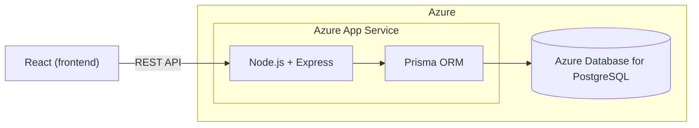

<!-- cSpell:ignore Elokuvaprojekti TMDB OAMK Iisa Veera Topi Tommi -->

# Elokuvaprojekti

A responsive movie web app for browsing and searching movies/series, viewing what's currently in Finnish cinemas, joining groups, writing reviews, and sharing favorite lists. Built with React, Node.js, and PostgreSQL, using [The Movie Database (TMDB)](https://www.themoviedb.org/) as the external movie data source.

School project for the Web Programming course at OAMK (Fall 2026).

Team: Iisa, Veera, Topi, Tommi.

## Architecture (high-level)

> Detailed technical documentation (architecture, API docs, diagrams, etc.) will be added under a separate `docs/` folder as the project progresses.
