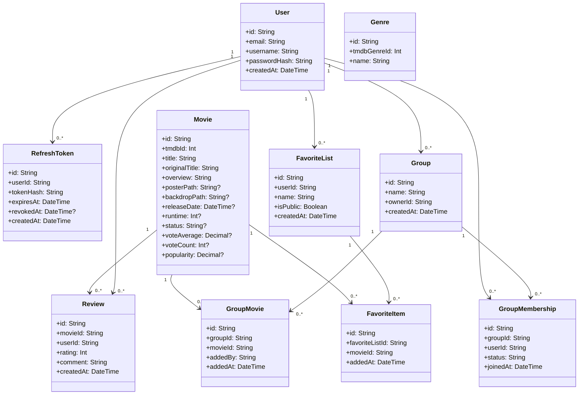

# Class Diagram

This document provides the design view for the key entities in the database and application logic. The diagram is intentionally simplified so it fits the assignment requirements and remains easy to read in GitHub.

## Class diagram

## Cascade delete rules

These rules must be enforced in the Prisma schema (`onDelete: Cascade` on the relevant relations) so that account and group deletion behave as required by the assignment:

- Deleting a `User` cascades to their `RefreshToken`, `Review`, `FavoriteList` (which in turn cascades to its `FavoriteItem` rows), and `GroupMembership` rows. This covers the assignment requirement that deleting an account also removes the user's reviews, favorite lists, and favorite list entries (features 11, 13, 14).
- Deleting a `Group` (by its owner) cascades to its `GroupMembership` and `GroupMovie` rows, so no orphaned membership or group-movie records remain.

## Explanation

This class diagram is based on the practical project architecture and the TMDB API structure. Its purpose is to model the essential data structures the project needs:

- user accounts and authentication
- movies and their metadata
- reviews
- groups and memberships
- favorite lists and movie entries associated with groups

Not every data model needs to mirror the full TMDB API structure exactly; the goal is to reflect the needs of the application and the course requirements. For this reason, the diagram is intentionally limited to keep it clear and practical.

## Why this works well for GitHub

- Mermaid syntax renders directly in GitHub Markdown.
- The diagram is easy to present and review.
- The document remains versioned and easy to share with professors.

## Related note

The sample JSON from TMDB is useful as a design reference, but it is too rich to copy directly as-is. For the assignment, it is enough to focus on the elements the application actually needs: movie, genre, user, review, group, and favorite list.
