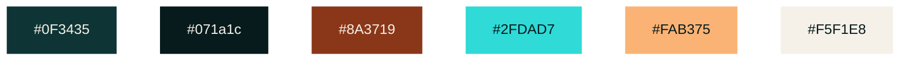

# Design System

## Colors

- **#0F3435** — Primary dark background
- **#071a1c** — Dark background
- **#8A3719** — Button background
- **#2FDAD7** — Turquoise text / accent
- **#FAB375** — Orange text / accent
- **#F5F1E8** — Light surface at 10% opacity & Text

## Usage

- `#2FDAD7` and `#FAB375` are used as text/accent colors only on `#0F3435` and `#071A1C`.
- `#8A3719` is used as a button background with `#F5F1E8` as button text.
- `#F5F1E8` is used at 10% opacity as a light surface on selected elements and as a main text color.
- Text combinations meet **WCAG AA (4.5:1 for normal text)**.

## Typography

- **Heading 1:** Roboto Condensed Bold — 32px — 5px letter spacing
- **Heading 2:** Roboto Condensed Light — 32px — 5px letter spacing
- **Body:** Mukta Vaani Light — 16px — 5px letter spacing
- **Accent 1:** Cousine Bold — 24px — 10px letter spacing
- **Accent 2:** Cousine Bold — 16px — 10px letter spacing

